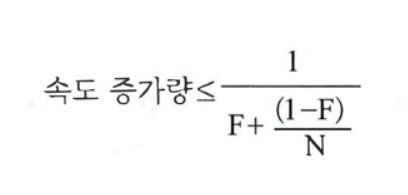
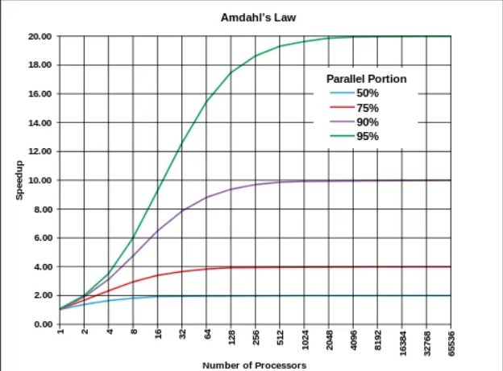
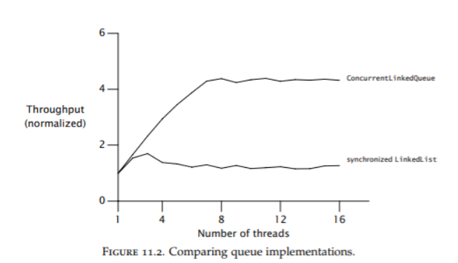
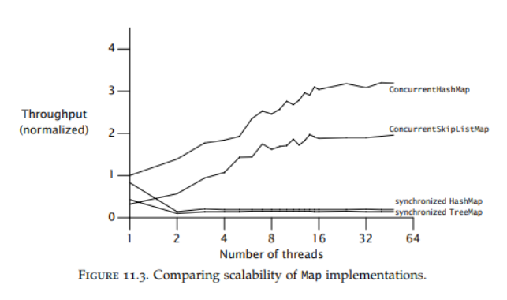

# 11. 성능, 확장성
> 스레드를 사용하는 가장 큰 목적은?

성능을 높이기 위해.

> 멀티 스레드를 사용하는 큰 이유 중 하나는?

다중 CPU 하드웨어를 충분히 활용하고자.

**이 장의 전체적인 맥락**
- 일반적인 경우에는 성능이 높은 것이 좋지만, 그렇다고 성능 때문에 안정성을 해칠 수는 없음.
- 일단 프로그램이 돌아가게 만든 다음, 그 다음에 성능을 신경쓰는게 낫다.
- 예상한 성능 기준이 있었다면, 그 기준에 미치지 못했을 때만 성능 문제를 살펴보는 것으로 충분 (특히 병렬 애플리케이션에서는)

## 11.1 성능에 대해
**여러 개의 스레드를 사용**하려 한다면, 항상 단일 스레드를 사용할 때보다 **성능상의 비용**을 지불해야 함
- 스레드 간의 작업 내용을 조율하는데 필요한 오버헤드 (e.g. 락 걸기, 신호 보내기, 메모리 동기화하기)
- 컨텍스트 스위칭
- 스레드 생성/제거가 빈번함
- 여러 스레드를 효율적으로 스케쥴링 해야함

<br>

>이러한 비용을 지불하더라도, 스레드를 효율적으로 적용하면
- 성능, 응답성이 높아짐
- 처리 용량도 커지는 등

의 장점을 얻을 수 있음

>반대로 잘못 설계된 병렬 애플리케이션은?

순차적으로 작업을 처리하는 프로그램보다 오히려 느리게 동작할 수도 있음

- 먼저 프로그램이 확보할 수 있는 모든 자원을 최대한 활용
- 남는 자원이 생길 때마다 최대한 활용할 수 있도록 해야함
- (= CPU가 최대한 바쁘게 동작해야 함)

=> 이러한 부분들을 우선적으로 생각해야함

## 11.1.1 성능 vs 확장성
- **성능** : 특정 작업을 처리하는 속도가 '얼마나 빠르냐'
- **확장성** : 동일한 자원을 갖고 있을 때 '얼마나 많은' 양의 일을 할수 있냐 

병렬 프로그램 환경에서 확장성을 충분히 가질 수 있도록 애플리케이션을 설계/튜닝하는 방법은 기존의 일반적인 성능 최적화 방법과 다른 경우가 많음

### 성능을 목표로
동일한 일을 더 적은 노력으로 하고자 하는 것 

(e.g. 캐싱해서 실행 속도 높이기, 알고리즘 바꿔서 시간복잡도 줄이기)

### 확장성을 목표로
처리해야 할 작업을 병렬화해 시스템의 가용 자원을 더 많이 끌어다 사용하면서 더 많은 일을 처리할 수 있도록 하는 것

> 얼마나 많이 vs 얼마나 빠르게

단일 스레드 애플리케이션에서의 성능 개선 방안은 대부분 확장성의 측면에서 효과적이지 않음 (11.4.4 참고)

---

### 11장에서 성능보단 확장성을 중점적으로 다루는 이유
" 처리 용량을 단시간에 급격하게 증가시키는 게 어렵기 때문"

- **별다른 튜닝을 하지 않은 단일 구조 애플리케이션**이 웬만큼 잘 만들어진 다중 티어 애플리케이션보다 성능이 나을 가능성이 많음
- 단일 구조는 서로 다른 티어 간 작업을 주고받는 도중에 발생하는 **네트웍 시간 지연**도 없고, 연산 작업을 처리할 때의 **부하**도 없기 때문

- 하지만 단일 구조의 애플리케이션이 처리할 수 있는 최대 부하를 넘어서면?
- '처리 용량을 단시간에 급격히 증가시키는 게 어렵기 때문'에 시스템 자원을 계~속 투입하면서도 서비스 시간이 훨씬 길어지는 걸 감수해야 함

> 그래서 서버 애플리케이션을 만들 때 '얼마나 빠르게' 보단 '얼마나 많이'를 더 중요하게 생각하는 경우가 많음

<br>

## 11.2 암달의 법칙
대부분의 병렬 프로그램에는 **병렬화할 수 있는 작업**과 **순차적으로 처리해야 하는 작업**이 뒤섞인 덩어리를 갖고 있음

> "애플리케이션의 확장성은 반드시 순차적으로 실행돼야만 하는 코드가 전체에서 얼마만큼의 비율을 차지하냐에 달렸다."

'암달의 법칙'을 사용하면 병렬 작업과 순차 작업의 비율에 따라 하드웨어 자원을 추가로 투입했을 때 **이론적으로 속도가 얼마나 빨라질지에 대한 예측 값**을 얻을 수 있음



즉, 작업을 순차 처리하는 부분이 많아질 때 느려지는 정도가 얼마만큼인지 수치화 할 수 있음



- 프로세서의 개수가 증가하면 할수록,
- 순차적으로 실행해야 하는 부분이 아주 조금이라도 늘어나면,
- 프로세서 개수에 비해 얻을 수 있는 속도 증가량이 크게 떨어짐

<br>

1. 애플리케이션 내부에서 순차적으로 처리해야 하는 작업이 얼마나 되는지를 먼저 확인
2. 멀티프로세서 시스템에서 속도가 얼마만큼 빨라질지 예측해 볼 수 있다!
(e.g. 작업 큐 사용 부분에서 `LinkedBlockingQueue` 사용 vs 동기화된 `LinkedList` 사용)

<br>

## 11.2.1 예제: 프레임웍 내부에 감춰져 있는 순차적 실행 구조
Q. 내부 구조에 순차적으로 처리해야 하는 구조가 어떻게 숨겨져 있는지 모르겠어요.

A. 1) 스레드 개수를 증가시킬 때마다 성능이 얼마나 빨라지는지 기록해두고, 2) 성능상의 차이점을 기반으로 순차적으로 처리하는 부분이 얼마만큼인지 추측해볼 수 있음


- `ConcurrentLinkedQueue`와 `synchronizedLinkedList` 모두 스레드 안전성은 보장되는 queue
- `ConcurrentLinkedQueue`는 개별 링크 포인터마다 단일 연산으로 업데이트하는 정교한 큐 알고리즘을 사용, 개별 포인터에 대한 업데이트 연산만 순차적으로 처리하면 됨
- 전체 큐의 상태를 하나의 락으로 동기화하는 `synchronizedLinkedList`에 비해 성능이 더 좋음

=> 단순히 적절한 자료구조 사용만으로도 확장성을 크게 늘릴 수 있음

<br>

**자주 발견되는 순차적 구조:**
- `로깅 시스템` : 모든 스레드가 같은 로그 파일에 쓰기
- `캐시 업데이트` : 전역 캐시 무효화로 인한 순차 처리
- `통계 수집` : 공유 카운터 변수 업데이트
- `설정 관리` : 런타임 설정 변경 시 전체 시스템 일시 정지

<br>

## 11.3 스레드와 비용
단일 스레드 프로그램은 스케줄링 문제나 동기화 문제가 있지도 않거니와 그에 따른 부하도 발생하지 않음

스레드 사용 시, 

> **병렬로 실행함으로써 얻는 이득 > 병렬로 실행하느라 드는 비용**

이렇게 되야 성능 향상을 시킬 수 있다.

## 11.3.1 컨텍스트 스위칭
하나의 스레드가 실행되다가 다른 스레드가 실행되는 순간 **컨텍스트 스위칭**이 일어남

- 컨텍스트 스위칭 실행 구조
    1. 먼저 현재 실행 중인 스레드의 실행 상태를 보관
    2. 다음에 실행되기로 스케줄된 스레드의 실행 상태를 읽어들임

- 부하와 비용
    - `5,000` ~ `10,000` 클럭 사이클 또는 수 마이크로초 동안의 시간 소모 (플랫폼마다 다름)
    - **유닉스 시스템의 `vmstat` 명령** or **윈도우 시스템의 `perfmon` 유틸리티** 사용 시 컨텍스트 스위칭이 일어난 횟수를를 확인할 수 있고, 커널 수준에서 얼마만큼 시간을 소모했는지도 확인 가능

<br>

## 11.4 락 경쟁 줄이기
- 락을 놓고 경쟁하는 상황에 벌어지면?
- 순차적으로 처리함과 동시에 컨텍스트 스위칭도 많이 일어나므로 확장성과 성능을 동시에 떨어뜨리는 원인이 됨.
- **즉, 락을 확보하고자 지속적으로 경쟁하는 상황에서는 확장성에 문제가 생김**

## 11.4.1 락 구역 좁히기
> 락을 확보한 채로 유지되는 시간을 최대한 줄여보자!

1. 락이 꼭 필요하지 않은 코드를 `synchronized` 블록 밖으로 뽑아내서, 락이 영향을 미치는 구역 좁히기
    - (e.g. `I/O 작업`과 같이 대기 시간이 발생할 수 있는 코드)

## 11.4.2 락 정밀도 높이기
> 스레드에서 해당 락을 덜 사용하도록 바꿔보자!
1. 락 분할
2. 락 스트라이핑

두 가지 모두 **서로 다른 락을 사용해 여러 개의 독립적인 상태 변수를 각자 묶어두는** 방법.

**락 분할**
- **장점**
    - 락으로 묶이는 프로그램의 범위를 조밀하게 나누는 효과 (**락의 정밀도가 높아짐**)
    - 대기상태에 들어가는 경우가 크게 줄어듦
    - 따라서, 결국 애플리케이션의 확장성 높아짐
- 단점
    - 락의 개수가 많아질수록 데드락 발생 위험 높아짐

- 경쟁조건이 아주 심하진 않지만 **그래도 어느 정도 경쟁이 발생하고 있는 경우** 가장 큰 효과
    - 대부분의 동기화 블록에서 락 경쟁이 일어나지 않도록 할 수 있음

## 11.4.3 락 스트라이핑
락 분할만 가지고는 더 이상 락을 쪼갤 수 없는 때가 있음

- 락 스트라이핑: 때에 따라 독립적인 객체를 여러 가지 크기의 단위로 묶어내고, 묶인 블록을 단위로 락을 나누는 방법

### ConcurrentHashMap의 락 스트라이핑 구현 예시

```java
public class LockStripingExample {
    // 16개의 락을 배열로 관리 (ConcurrentHashMap의 기본 세그먼트 수)
    private static final int LOCK_COUNT = 16;
    private final Object[] locks = new Object[LOCK_COUNT];
    
    // 실제 데이터를 저장할 해시맵
    private final Map<String, String> data = new HashMap<>();
    
    public LockStripingExample() {
        // 각 락 객체를 초기화
        for (int i = 0; i < LOCK_COUNT; i++) {
            locks[i] = new Object();
        }
    }
    
    /**
     * 키의 해시값을 기반으로 해당하는 락을 선택
     * ConcurrentHashMap과 동일한 방식으로 해시값을 16으로 나눈 나머지를 사용
     */
    private Object getLock(String key) {
        int hash = key.hashCode();
        // 해시값의 절댓값을 사용하여 음수 인덱스 방지
        int lockIndex = Math.abs(hash) % LOCK_COUNT;
        return locks[lockIndex];
    }
    
    /**
     * 키-값 쌍을 저장
     * 해당 키의 해시값에 대응하는 락만 사용하여 동기화
     */
    public void put(String key, String value) {
        Object lock = getLock(key);
        synchronized (lock) {
            data.put(key, value);
        }
    }
    
    /**
     * 키에 해당하는 값을 조회
     * 해당 키의 해시값에 대응하는 락만 사용하여 동기화
     */
    public String get(String key) {
        Object lock = getLock(key);
        synchronized (lock) {
            return data.get(key);
        }
    }
    
    /**
     * 키에 해당하는 항목을 삭제
     * 해당 키의 해시값에 대응하는 락만 사용하여 동기화
     */
    public String remove(String key) {
        Object lock = getLock(key);
        synchronized (lock) {
            return data.remove(key);
        }
    }
}
```

**락 스트라이핑의 핵심 원리:**
- 전체 해시 범위를 16개의 세그먼트로 나누어 각각 독립적인 락으로 관리
- 키의 해시값을 16으로 나눈 나머지(`hash % 16`)를 사용해 해당하는 락 선택
- 해시 함수가 맵에 있는 항목을 적절히 분산시킨다면, 락 경쟁 확률을 1/16로 줄일 수 있음
- 서로 다른 해시값을 가진 키들은 서로 다른 락을 사용하므로 동시에 접근 가능

## 11.4.4 핫 필드 최소화
- **핫 필드** : 모든 연산을 수행할 때마다 한 번씩 사용해야 하는 카운터 변수와 같은 부분
- 이렇게 모든 변수에 꼭 필요한 변수가 있다면 락의 정밀도를 세밀하게 쪼개는 방법을 적용할 수 없음
- 성능과 확장성이 서로 공존하기 어렵게 만드는 요인
- (e.g. 캐싱)

위에서 살펴본 `ConcurrentHashMap`의 경우 전체 카운트를 하나의 변수에 두지 않고, 락으로 분배된 각 부분마다 카운터 변수를 따로 두고 관리함

## 예제) 11.5 Map 객체의 성능 분석
Q1. 병렬 처리 환경에서 동기화된 HashMap 클래스가 속도가 떨어지는 가장 큰 이유는?

A. **맵 전체가 하나의 락으로 동기화**되어 있기 때문 

Q2. 병렬 처리 환경에서 `ConcurentHashMap`의 성능이 압도적으로 좋은 이유는?

A. 읽기 연산에는 락을 걸지 않았고, 쓰기 연산과 일부 읽기 연산에는 락 스트라이핑을 활용함 

-> 따라서 대부분의 경우 대기 상태에 들어가지 않고도 다수의 스레드가 동시에 `ConcurentHashMap` 기능 활용 가능


- `synchronizedMap`으로 동기화된 맵들은 **스레드 개수가 늘어날수록** (= 경쟁이 발생하는 상황으로 넘어갈수록) **성능이 급격하게 저하**
- 한 번 경쟁이 발생하기 시작하면 연산에 필요한 시간의 대부분이 **컨텍스트 스위칭**과 **스케줄링에 필요한 대기 시간**으로 소모됨
- 스레드를 추가한다 해도 성능 향상엔 효과 X

## 11.6 컨텍스트 스위치 부하 줄이기
컨텍스트 스위치 횟수를 줄이면 서버의 처리량에 큰 도움을 줄 수 있음

### 예시: 요청을 처리할 때 로그를 출력하는 경우
1. 필요한 곳 마다 `println` 문장 호출하기
2. 로그 출력만을 전담하는 백그라운드 스레드에서 출력하기

<br>

- 1번의 경우
    - `I/O` 연산과 스트림에 대한 락에 직접적으로 연결
    - 따라서 컨텍스트 스위치가 빈번하게 발생할 가능성 높음
    - 이에따라 서비스 시간이 점점 늘어나면, 서비스의 품질에 직접적으로 타격
- 2번의 경우
    - log 메소드를 호출하는 스레드: 출력할 로그 메세지를 큐에 쌓아두는 즉시 리턴
    - 로그 출력 스트림을 공유하지 않아도 됨
    - 즉, 스레드가 대기 상태에 들어갈 일이 거의 없다. 

**다수의 스레드에서 발생할 I/O 연산을 단 하나의 스레드에서 처리하도록 한 군데에 몰아넣어서, 요청을 처리하는 평균 시간을 줄임** 

<br>

## 11장 정리
**확장성을 위해서는 락을 최소한만 사용하자!**

    - 락으로 동기화하는 범위를 세분화해 정밀도를 높인다.
    - 락을 확보하는 시간을 최소한으로 줄인다.
    - 독점적인 락 대신 독점적이지 않은 방법을 사용한다.
    - 대기상태에 들어가지 않게 한다.

## 논의 해보고 싶은 점
1. 애플리케이션의 내부에 숨겨져있는 '순차적으로 처리해야 하는 구조'를 어떻게 찾을 수 있을까
2. 프로젝트를 하면서 성능 vs 확장성 사이에서 고민해 본 경험
3. ConcurrentHashMap을 다른 구조에 적용해 본 경험 
    - (기존 동기화 된 코드를 ConcurrentHashMap 등으로 리팩토링 한 경험)
4. 각자 성능 튜닝을 할 때 우선순위가 있다면?
5. 락 경합 때문에 성능이 떨어졌던 경험


<br>

### 참고 자료
- [암달의 법칙 위키백과](https://ko.wikipedia.org/wiki/%EC%95%94%EB%8B%AC%EC%9D%98_%EB%B2%95%EC%B9%99)